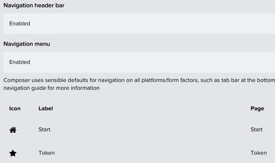

[](https://api.reuse.software/info/github.com/SAP-samples/appgyver-auth-flows)

# SAP AppGyver and Proof Key for Code Exchange (PKCE) <br>**or** Striving for enterprise-grade security in SAP low-code applications

# Introduction
In this GitHub repository and the associated blog post (click here), we will demonstrate you how to:

1. Configure a SAP Identity Authentication Service (IAS) application for public client usage and enabled for cross-consuming SAP XSUAA services.
2. Create an SAP AppGyver application that implements OAuth 2.0 authorization and token flows with PKCE, from an iOS device
3. Manage access tokens and refresh tokens, and use them with a protected SAP Cloud Application Programming (CAP) service running in the SAP BTP, Cloud Foundry runtime

Whereas the **blog post** covers the **theoretical basics** and reasons for using SAP Identity Authentication and the so-called PKCE flow for authentication and authorization requirements, this **GitHub repository** will provide you a **step-by-step guideance** on how to set up things on your own. 

**Important -** Before you continue with the actual setup of the scenario in your own landscape, please make sure to read the relevant blog post (click here) first. It will give you a good understanding of the architecture pattern and service requirements for the sample setup. 

This GitHub repository consists of two major parts, which cover the setup of your SAP subaccount and Identity Authentication instance and a detailed guide on how to configure your SAP AppGyver sample application.

**Authentication and authorization using the PKCE flow (SAP IAS and SAP XSUAA)**

- SAP BTP and SAP Identity Authentication security setup
    - SAP XSUAA - SAP Identity Authentication trust
    - SAP Cloud Identity Services instance
    - SAP XSUAA service instance
    - SAP IAS user group and role collection mapping
    - SAP IAS – SAP XSUAA token exchange

- SAP AppGyver configuration for OAuth 2.0 with PKCE flow
    - Initial app setup
    - OAuth configuration
    - PKCE implementation
    - Add pages to display OAuth response and test
    - Utilize local device storage and refresh tokens
    - Access a SAP CAP service using Bearer token from token exchange

**Authentication and authorization using the Authorization Code grant flow (SAP XSUAA only)**

- SAP BTP security setup
    - SAP XSUAA service instance

- SAP AppGyver configuration for OAuth 2.0 with Authorization Code grant flow
    - Initial app setup
    - OAuth configuration
    - Authorization Code implementation
    - Add pages to display OAuth response and test
    - Utilize local device storage and refresh tokens
    - Access a SAP CAP service using Bearer token from token exchange

# Authentication and authorization using the PKCE flow

## SAP BTP and SAP Identity Authentication security setup

Complete the following steps to setup your SAP BTP and Identity Authentication environment for the required PKCE flow used by SAP AppGyver and the SAP XSUAA cross-consumption. 

### SAP XSUAA - SAP Identity Authentication trust

1. Make sure a trust between you SAP BTP Subaccount (XSUAA) and your SAP Identity Authentication instance has been set up. Make sure you use the **Establish Trust** feature for this purpose instead of the manual configuration!

    > **Hint –** This will only work if the customer ID associate with your SAP BTP Global account and your SAP Identity Authentication service match! More details on this step can be found in SAP Help.

    


2. Select the SAP Identity Authentication instance which you want to connect to your current SAP BTP Subaccount. After a few seconds, trust should be established successfully. 

    >**Hint –** In case you cannot see your existing SAP IAS instance here, please open a support ticket to the component BC-IAM-IDS to make sure your instance is mapped to your SAP BTP environment based on your customer ID. 

    


3. You should now see a new custom OpenID Connect trust between your SAP BTP Subaccount and your custom SAP IAS instance with the Origin Key **sap.custom**. SAP IAS can now act as trusted OpenID Connect identity provider for your SAP BTP subaccount. 

    

4. Login as an administrator to your SAP Identity Authentication service and open the **Applications** overview. You should now see a new **Bundled Application** with following name syntax XSUAA-`<Subaccount Name>`. This application was created when you set up the trust between your SAP BTP Subaccount and and the SAP Identity Authentication service.

    


5. You can check the details of this OpenID Connect application configuration in the respective sub-menus. Here you can for example see the redirect URLs leading back to your SAP BTP environment.

    

    Well done, you’ve set up the required trust between your SAP BTP XSUAA environment and SAP Identity Authentication. In the next step you can make use of this trust and create a new application registration in SAP Identity Authentication using a dedicated SAP BTP service broker. A manual configuration within SAP IAS is not required anymore. 


### SAP Cloud Identity Services instance

To simplify development and configuration, you can create new application registrations in SAP Identity Authentication also via a dedicated service broker of your SAP BTP subaccount. Please be aware this only works if an OIDC-based trust has been setup between SAP BTP subaccount and your SAP IAS instance. 

1. Go to the Instances and Subscriptions menu of your SAP BTP Subaccount and create a new service instance of type **Cloud Identity Services** (identity). This service instance will create a corresponding application registration in SAP IAS. Select the **application** plan and give your service instance a reasonable name. You can e.g., name it **demoApp-ias**. Then click on **Next**.

    

2. Provide the required configurations for your instance, which the service broker will use to create the corresponding application registration in SAP IAS. You can use the provided JSON file (see below) for the current sample use case. Once configured, please click on **Create**. 

    

    ```
    {
        "multi-tenant": true,
        "xsuaa-cross-consumption": true,
        "oauth2-configuration": {
            "public-client": true,
            "redirect-uris": [
                "https://localhost/",
                "http://localhost/"
            ],
            "token-policy": {
                "refresh-parallel": 1,
                "refresh-validity": 7776000,
                "token-validity": 1800
            }
        }
    }
    ```

    Of special importance are the parameters described in the following. 
    > For the other parameters please check the official documentation of the SAP Cloud Identity service if not self-explanatory (like validity of access and refresh tokens).

    - **xsuaa-cross-consumption:**  true
        >This will add the Client ID of the XSUAA application registration (which was created in IAS when you configured the trust between SAP BTP XSUAA and SAP IAS) to the Audience of the token issued by the new application registration created by the service broker. This setting is essential, as it will allow a token exchange from a token issued by SAP IAS to a corresponding token issued by SAP XSUAA. 

    - **public-client** : true
        > This will make your new SAP IAS application registration used by AppGyver a public application. As a consequence, you can use the PKCE flow but no more Client Secrets can be created for this application anymore. 

    - **redirect-urls** : https://localhost/, http://localhost/
        > Within SAP AppGyver we will extract the Authorization Code from the resulting redirect URL after the user has successfully authenticated against the SAP IAS application. For this process we use a WebComponent within SAP AppGyver and add a change event for the URL value of this component. Once the WebComponent URL changes to **localhost**, we can extract the required authorization code. More details on this approach will follow later or can be found in the following SAP AppGyver forum post ([click here](https://forums.appgyver.com/t/oauth2-registration-login-flow/215/19)).

      >**Hint -** In case you want to authenticate a user in the native mobile browser instead of a WebComponent (which is also possible), a redirect to your AppGyver app is required ([click here](https://forums.appgyver.com/t/oauth2-registration-login-flow/215/16) for more details). As SAP IAS can only redirect to **http** or **https** URL prefixes, this makes testing the app impossible. Whereas for a standalone build, a custom URL scheme (e.g., iOS [click here](https://developer.apple.com/documentation/xcode/defining-a-custom-url-scheme-for-your-app)) for redirects could be used, the SAPAppGyver test app relies on the **sapappgyverrn://** URL prefix for redirects.

3. It will take a while but once the service broker has finished its job, you can switch back to the SAP Identity Authentication service. Here you will see a new application registration, which was created based on your JSON configuration and is named like the corresponding service instance.

    

4. Select your new application registration and check out the settings. You can for example open the **Client ID, Secrets and Certificates** configuration. Here you will see that your application is serving **public clients**. This allows the usage of **PKCE** for the required authorization grants. 

    

    

5. Another interesting aspect to check is the XSUAA cross-consumption capability, visible in the **Consumed Services** configuration. You can see that your new application **consumes** the application registration which was created when you set up the trust between your SAP IAS and SAP BTP environment (SAP XSUAA). 

    >**Hint –** As already explained, this will add the client ID of your SAP XSUAA related application registration (created by the trust setup) to the **Audience** parameter of access tokens issued for the app registration (supporting public clients) used by SAP AppGyver. 

    >As SAP IAS (issuing the tokens) has been added as trusted identy provider to SAP XSUAA, this allows a token exchange from SAP IAS tokens to SAP XSUAA tokens. Therefore, the **JWT Bearer Token Grant** ([click here](https://docs.cloudfoundry.org/api/uaa/version/75.15.0/index.html#jwt-bearer-token-grant)) flow is used which follows RFC7523 ([click here](https://datatracker.ietf.org/doc/html/rfc7523)).

    

    

### SAP XSUAA service instance

An SAP XSUAA service instance is required for our scenario, as SAP CAP relies on SAP XSUAA for authorization handling. 

1. That’s it, you can now authenticate against SAP IAS and use the issued token to access SAP BTP services secured by SAP XSUAA. We will test the token exchange in the next step. Before doing so, you need to create an SAP XSUAA service instance first. Make sure to choose the **application** plan. You can e.g., name your instance **demoApp-uaa** 

    > **Hint** - If you choose a different name please also update the CAP project before deployment!

    

2. This SAP XSUAA service instance will be bound to your SAP CAP application and allows your application to validate the token issued by SAP XSUAA in exchange for the initial SAP IAS token. 

    > **Hint** – You will not notice the exchange taking place. This feature is already integrated in to the **@sap/xssec** Node.js package which will recognize whether a token comes from SAP IAS or SAP XSUAA and trigger an exchange if necessary. 

    Provide the following JSON file as configuration for your SAP XSUAA service instance. It will create an **admin role** for your application. Update the xsappname if required or keep the recommended **demoApp** value.

    ```
    {
      "xsappname": "<App name e.g., demoApp>",
      "tenant-mode": "dedicated",
      "scopes": [{
        "name": "$XSAPPNAME.admin",
        "description": "admin"
      }],
      "attributes": [],
      "role-templates": [{
        "name": "admin",
        "scope-references": [
          "$XSAPPNAME.admin"
        ],
        "attribute-references": []
      }],
      "oauth2-configuration": {
        "redirect-uris": [
          "http://localhost/",
          "https://localhost/"
        ]
      }
    }
    ```

3. Once the SAP XSUAA service instance is created, create a new service key for testing purposes. You can e.g., name it **demoApp-uaa-key**. 

    >This service key is only used for testing purposes to do a manual token exchange. During deployment, a regular binding will be created between your SAP CAP application and this SAP XSUAA service instance.

    

### SAP IAS user group and role collection mapping

1. Create a new User Group in SAP IAS and assign your future SAP AppGyver app users to that group. You can for example call the user group **DemoApp**. 

    


2. In your SAP BTP subaccount, create a new role collection (e.g., **DemoApp**) containing the **admin** role which was created when setting up the SAP XSUAA service instance for your SAP CAP application. 

    In your role collection, create a **group mapping** for the SAP IAS user group you just created (e.g., **DemoApp**), so group members are assigned the relevant SAP XSUAA role collection automatically. 

    


### SAP IAS – SAP XSUAA token exchange

The provided GitHub repository contains a folder called **http**, which provides some sample requests to check your configuration before building things in SAP AppGyver. 

1. Open the **authTest.http** file in SAP Business Application Studio or Visual Studio Code (plugin required) to start the tests in your own environment. First update the **variable values** at the beginning of your file. 


   

    - **iasHostname** : Your SAP IAS hostname e.g., https://customerxyz.accounts.ondemand.com
    - **xsuaaHostname** : The hostname of your subaccount's XSUAA instance e.g., https://customerxyz-dev.authentication.eu10.hana.ondemand.com
        > **Hint** - You can find this value using service key which you created for your SAP XSUAA service instance in one of the previous steps. 
    - **iasTokenEndpoint** : Most probably **/oauth2/token**.
    - **capiasClientId** : The client ID of your SAP IAS application registration.
        > **Hint** - You can get the GUID value from the SAP IAS administration console.
    - **codeChallenge** : A SHA256 encrypted code challenge value.
        > **Hint** - For testing you can use the provided code challenge or get a new PKCE code challenge value using available online tools.
    - **codeVerifier** : The unencrypted version of your code challenge value.
        > **Hint** - For testing you can use the provided code verifier or get a new PKCE code verifier value using available online tools.
    - **btpXsuaaClient** : Your SAP XSUAA service instance client ID.
        > **Hint** - You can find this value using service key which you created for your SAP XSUAA service instance in one of the previous steps. 
    - **btpXsuaaSecret** : Your SAP XSUAA service instance client secret
        > **Hint** - You can find this value using service key which you created for your SAP XSUAA service instance in one of the previous steps.
    - **capEndpoint** : The runtime URL of your SAP CAP service e.g., https://localhost:4004 for local testing


2. Call the authorization endpoint of your SAP Identity Authentication instance in your local browser, after updating the below URL to your custom settings. 

    https://`<iasHostname>`/oauth2/authorize?client_id=`<capiasClientId>`&code_challenge=`<codeChallenge>`&code_challenge_method=S256&scope=openid&redirect_uri=http://localhost/&response_type=code&state=state

    >**Hint** – We will not cover topics like the **state** or **nonce** parameter in this scenario ([click here](https://auth0.com/docs/secure/attack-protection/state-parameters)). Please use these parameters for additional security in your environment!

3. After a successful login using your SAP IAS user credentials, you will be forwarded to a **localhost** url, which contains the required Authorization Code. Copy the code **value** from your address bar. 

    

4. Go back to your **authTest.http** file and paste the code value which you just copied into the request named **getIasToken** as **code parameter**. Please be aware this authorization code is only **valid for a few minutes**! The rest of the parameters remains constant or is filled by your variables. Send the POST request to obtain an **id_token** and **access_token** from SAP IAS. 

    

5. Feel free to decode the **id_token** (using an online decoder), which will result in something similar to the following. You can see, the relevant parameters for the upcoming token exchange like issuer (iss) and audience (aud), which contains the client ID of your SAP XSUAA application registration. This ID is also stored in your SAP XSUAA server as so-called relying party.

    

6. Now you can trigger the token exchange of this SAP IAS token to a token issued by SAP XSUAA, using the request named **doXsuaaTokenExchange**. The parameters are either static or filled by the response of your previous request automatically (like the id_token). 

7. Decoding the resulting token issued by SAP XSUAA will result in something similar to the following. Without going into the details, you can see that the token is now issued by SAP XSUAA and contains additional SAP XSUAA specific information like attributes or role collections based on the group mapping which you've done in the previous chapter. 

    >**Hint** - As already said, the **@sap/xssec** Node.js package is able to validate SAP IAS tokens automatically once your SAP CAP endpoints are called, so no manual token exchange is required. 

    

8. So if you are able to sucessfully run the manual token exchange, feel free to continue with the next chapter, that will explain how to implement things in SAP AppGyver. 

## SAP AppGyver configuration for OAuth 2.0 with PKCE flow

Complete the following steps to create an SAP AppGyver mobile app that supports OAuth 2.0 with Proof Key for Code Exchange (PKCE) as authorization grant type.

### Initial app setup

  1. Run the LCNC Booster in SAP BTP (if not done yet).

  2. Access SAP AppGyver from LCNC application lobby and create a new app called **demoApp**.

  3. Create a page called **OAuth**.

  4. Select **AUTH** and enable authentication for the app.

  5. Select **Direct third party authentication**.

  6. Set **OAuth** to be the initial view.

  7. Delete the login page.

  8. Select the **OAuth** page.

  9. Remove the default widgets and add a WebView component to the canvas. You will need to install it from the component market (note that WebView component only renders on mobile device).
     - set URL property to: "https://`<ias tenant>`.accounts.ondemand.com/oauth2/authorize?client_id=`<public client ID>`&scope=openid&code_challenge=`<123>`&code_challenge_method=S256&redirect_uri=http://localhost/&response_type=code"

     - Update the **ias tenant** and **public client ID** values with the ones from your SAP IAS environment.

     - The code challenge is only a placeholder and we will replace the whole URL property with an application variable in a later step.

     - Set layout of WebView to Width and Height > Advanced > Grow set to 1.

       

     - Set layout of WebView > Position > Align Self to Align this horizontally to the middle.

  10. Select Page Layout element > Style > Check **Stretch to Viewport Height** and **Disable Scrolling**.

  11. Expand Padding and clear it to make the component full screen.

  12. Save your application.

### OAuth configuration

  1. Click **Variables** and add an App variable with the following properties:
     - **Variable name**: auth
     - **Variable value type**: Object
     -  Add the following object properties, as below
         - authCode (text)
         - authToken (text)
         - expiresIn (text)
         - idToken (text)
         - refreshToken (text)

          
        
  2.  Add 2 Üage variables to hold the PKCE relevant properties:
      - auth_with_pkce (web URL)
      - code_verifier (text)

         

  3.  Save the application and go back to the **VIEW** screen.

  4.  Update the URL field of the WebView component to the newly created **auth_with_pkce** Page variable.

       

  5.  Select the WebView component and expand the logic section from the bottom.

  6.  Install the HTTP request component from the flow function market.

       
 
  7.  Configure each node as follows:
      1.  Add a **JavaScript function** and connect it to the Component **onLocationChange** event. Double-click it to open the JS editor and fill the required sections:
          -  **input1**: Output Value of another node > Receive event / Event Object
          -  **JavaScript**:  
              ```
              if(inputs.input1.url.includes('localhost/?code')){
                var code = inputs.input1.url.split('code=')[1].split('&state')[0];
                return { code : code, codeAvailable: true } 
              }else{
                return { codeAvailable: false } 
              }
              ```
              > The javascript above parses the response body returned by the authorize endpoint and adds the code and a boolean to the output of the node.

          - **Output 1 properties**:
             - code (text)
             - codeAvailable (text)

          

      2.  Add an **If condition** and connect it to the output node of the **JS > Output Value of another node > Function > codeAvailable**.

            
      3.  Add a **Set app variable** function, connect it to the 1st node of the if condition, which is triggered on a truthy result and configure it like the following:
            - **Variable name:** auth.authCode
            - **Assigned value:** Output value of another node > Function > code

      4.  Add an **HTTP Request** and connect it to the output node of the Set app variable function:
          -  **URL:**  "https://`<ias tenant>`.accounts.ondemand.com/oauth2/token?grant_type=authorization_code&client_id=`<public client id>`&code="+outputs["Function"].code+"&redirect_uri=http://localhost/&code_verifier="+pageVars.code_verifier
          -  **HTTP Method:** POST
          -  **Headers** (Custom List)**:**
              -  Header: Content-Type  
              -  Value: application/x-www-form-urlencoded
          -  **Request Body Type:** x-www-form-urlencoded

              

      5.  Add a **Dismiss initial view** component and connect it to the same output from Set app variable.

      6.  Add another **Set app variable** component, connect it to the 1st output of the HTTP request, and clone it 3 times. Set the following variable names and assigned values as below:
          -  **auth.authToken:** Formula > STRING(outputs["HTTP request"].resBodyParsed.access_token)
          -  **auth.refreshToken:** Formula > STRING(outputs["HTTP request"].resBodyParsed.refresh_token)
          -  **auth.idToken:** Formula > STRING(outputs["HTTP request"].resBodyParsed.id_token)
          - **auth.expiresIn:** Formula > STRING(outputs["HTTP request"].resBodyParsed.expires_in)

  8.  Save the app before continuing and check that your logic flow looks something like this:
      
      

### PKCE implementation

It is now necessary to add logic at the **page layout** level that generates the code challenge and verifier needed for the PKCE flow. Because the JavaScript runs in the local device browser, it doesn't meet the criteria for a straightforward implementation of crypto.subtle. You can find a polyfill JavaScript in this repository that will enable the implementation.

1.  Select the **Page Layout** component from the tree.

2.  Expand the logic modeler, add a **JavaScript** component to the canvas, and connect it to the **Page mounted event**.

3.  Double-click the JS component and paste the code from [pkceCoding.js](./appGyver/pkceCoding.js) into the JavaScript pane.

4.  Add a property called **verifier** and another called **challenge** to Output 1. Set the value types to Text and click update.

    

5. Add a **Set page variable** component and connect it to the output of the JS node.

6. Set the variable name to **code_verifier** and assign the value **Function / verifier**.

    

7. Add another **Set page variable** component and connect it to the JS output node as well.

8. Set the variable name to **auth_with_pkce** and set the value to a formula. Use the following dynamic URL syntax, disregard any validation errors related to web-url types and save:

    "https://`<ias tenant>`.accounts.ondemand.com/oauth2/authorize?client_id=`<public client id>`&scope=openid&code_challenge="+outputs["Function"].challenge+"&code_challenge_method=S256&redirect_uri=http://localhost/&response_type=code"

    >**Important** - In case you're facing issues (e.g., your login page not being loaded), try to **url-encode** your client ID and the redirect url. 

9. Your flow logic should look similar to the image below. Save the application before proceeding.

    

### Add pages to display OAuth response and test

This is the perfect time to test the logic that you have implemented in the previous steps. First, let's add new AppGyver pages and enable navigation, so that we can see the OAuth response and corresponding properties.

1. Click the page name **OAuth** in the top left corner under the application name. Add 2 new pages, **Start** and **Token**. Save the application.

2. Select **Navigation**, add 2 items, and set the Label and Page values accordingly. Pick any icons that suit you. Make sure **navigation is enabled**, as below.

    

3. Access the **Start page**, update the title, and add some text fields to hold the authorization code and access token values. Set the value rows to **auth.authCode** and **auth.authToken** respectively.

    

4. Access the Token page, update the title, and add some text fields to hold the remaining properties, **refresh token**, **expires in**, and **id token**.

    

5. Save the app if you haven't recently and select the launch option. You will need to install the **SAP AppGyver app** from the Apple **App Store** to take the next steps.

6. Click **Reveal QR code** under Mobile Apps and scan it from the SAP AppGyver app.

7. Enter your logon credentials for the SAP IAS tenant. The process should look something like the below quick demo.

    


### Utilize local device storage and refresh tokens

Now that we can retrieve an access token using the OAuth 2.0 PKCE flow, we could stop here and simply generate a new token with every call. However, it is a best practice to leverage the **refresh token** that can be used for a significantly longer period of time. Based on our configuration, an access token is good for 30 minutes and a refresh token is valid for 2.5 months!


  
To do this, we will use the **SAP AppGyver flow components** for getting or setting an item to **local storage**.

1.  Access the **OAuth page** and select the WebView component. Expand the logic modeler.

2.  Select the flow function market and install the **Get item from storage** and **Set item to storage** components.

3.  Add a **Set item to storage** component to the canvas and connect it to the output node of **Set app variable > Set auth.refreshToken**.

4.  Set the item key to **refreshToken** and the data to store as the app variable **auth.refreshToken**.

5.  Duplicate that component, connect it to the same output node as the previous step, set the item key to **refreshTimestamp** and the data to store as the formula **NOW()**.

    

6. Select the **Page Layout** where you add the following logic. The required steps will be described in detail. 
   - Get item from storage and retrieve the **refreshTimestamp** of the refresh token set in the previous step.
   - An **if condition** to evaluate the number of seconds between now and the time that the refresh token was originally retrieved.
   - If that value is less than **7776000 seconds** (or your **refresh token validity** value) then get the refresh token from local storage. If not, invoke the PKCE flow.
   - If the previous step resulted in a valid refresh token, set the app variable **auth.refreshToken** to the local storage result.
   - Call the token endpoint with a **grant_type** of **refresh_token** and the retrieved token value.
   - Update the **auth app variable** object, setting the auth code to **Refresh**.
   - **Reset** the **refreshToken** and **refreshTimestamp** values in local storage to the updated values, as a refresh token can only be utilized once.
   - All errors or failures will be routed back into the JS logic for **initiating the PKCE flow**.

7. Delete the connection from the **Page mounted** event to the **JS component**.

8. Add a **Get item from storage** component and set the item key to **refreshTimestamp**

9. Add an **If condition**, connect it to the first output node of the previous component, and set the condition to a formula with the value:

    ```
    IF(DATETIME_DIFFERENCE(DATETIME(NOW("")), DATETIME(outputs["Get item from storage"].item), "seconds")<7776000, true, false)
    ```
    >**Important** - Adapt the validity of your refresh token if you've chosen another value in your respective service instance. 

10. Add another **Get item from storage** component, connect it to the first output node of the previous step, and set the item key to **refreshToken**. Connect the second output node of the if condition to the JS component for the PKCE flow. This ensures that any failure in the evaluation results in the user being prompted to login again.

11. Add a **Set app variable** component and connect it to the first output node of the **Get item from storage** > **refreshToken** component. Set the variable name to **auth.refreshToken**. Set the assigned value to the item in the previous node's output:

     ```
       STRING(outputs["Get item from storage"].item)
     ```

12. Create an **HTTP request** and set the parameters as follows:
    - **URL:** "https://`<ias tenant>`/oauth2/token?grant_type=refresh_token&client_id=`<public client id>`&refresh_token="+appVars.auth.refreshToken
    - **HTTP method:** POST
    - **Headers:**
        - **header**: Content-Type 
        - **value**: application/x-www-form-urlencoded
    - **Request body type:** x-www-form-urlencoded

        >**Important** - In case you're facing issues try to **url-encode** your client ID and the redirect url. 

13. Add a **Set app variable** component and set the variable name to **auth**. Configure the assigned value as below:
    - **authCode:** Static text > Refresh
    - **authToken:** Formula > STRING(outputs["HTTP request"].resBodyParsed.access_token)
    - **refreshToken:** Formula > STRING(outputs["HTTP request"].resBodyParsed.refresh_token)
    - **idToken:** Formula > STRING(outputs["HTTP request"].resBodyParsed.id_token)
    - **expiresIn:** Formula > STRING(outputs["HTTP request"].resBodyParsed.expires_in)

14. Add two **Set item to storage** components and connect them to the output of the previous node. Configure them for the keys **refreshToken** and **refreshTimestamp** as you did in the previous steps 4-5.

15. Add a **Dismiss initial view** component and connect it to the same **Set app variable** node.

16. Your logic flow should look something like this. Note that you can connect all **failure outputs** back to the **JavaScript** that invokes the **PKCE flow**. We only dismiss the Initial view when a Bearer token is acquired, either by the refresh token or a user login.

    

### Access an SAP CAP service using a Bearer token from token exchange

A sample SAP CAP service has been provided in [demoApp](./demoApp/) that you can deploy to test the E2E authentication and authorization flow. You can deploy it with the [usual steps](https://cap.cloud.sap/docs/guides/deployment/#build--assemble).

Once the service is deployed, use the following steps to access the secure endpoint in SAP AppGyver:

1. Select the **DATA** tab and add a new OData integration.

2. Set the Authentication Type to **Bearer token**.

3. To retrieve the metadata, you will need to use the [authTest.http](./demoApp/http/authTest.http) file to manually create the initial Bearer token. Copy the value into the Authentication token field.

    > **Hint** - To get the required access token, please repeat the steps required for the token exchange between SAP IAS and SAP XSUAA explained in one of the previous chapters. 

4. Configure the **Base URL** to the demo CAP service at https://`<CAP service url>`/demo and save the resource.
    > **Hint** - Make sure to deploy your SAP CAP service to your SAP BTP Subaccount as localhost will not be working here. 

    

5. Add a **new page** called **Data**, select it, and switch to toggle from **VIEW** to **VARIABLES** option.

6. Add a **Data Variable** and select the **User resource**.

7. Set the **Bearer token authentication** to a custom object and set the authentication token value to **auth.authToken** app variable.

    

8. Delete the automatic refresh timer from the logic section.

    

9. Switch to the **View** pane.

10. Add two text components and set the values to formula **data.User1[0].userId** and **data.User1[0].isAdmin** respectively.
    
    

11. Add the Data page to your navigation, save the application and preview it on your mobile device.

12. Note that **isAdmin** will show as **true**, as you've assigned your SAP IAS user to the corresponding user group which is mapped to the SAP BTP role collection (done in one of the previous chapters).

13. For testing purposes, you can remove your SAP IAS user from the respective user group to see if the isAdmin value changes. 

14. Refresh the app and note that isAdmin now shows false. If not, try to logout and login again! Your email address is also displayed successfully.

This is the end of the basic OAuth 2.0 PKCE flow implementation. From here, you can also propagate a user principle to other systems, such as SAP SuccessFactors or SAP S/4HANA.


# Authentication and authorization using the Authorization Code flow

## SAP BTP security setup

Complete the following steps to setup your SAP BTP environment for the  Authorization Code flow used by SAP AppGyver. 

**Important!** - This scenario is **not recommended** for a **productive environment**, as the client secret is stored on the device of your users and is send in HTTP requests to your SAP CAP application. Only use it for testing purposes! The Authorization Code grant flow is only suitable for scenarios in which the client is able to securely store the client secret like the backend of a web server. 

### SAP XSUAA service instance

1. Ceate a new SAP XSUAA service instance which will be bound to your SAP CAP application and provides the required client credentials for accessing your OData service from SAP AppGyver. Make sure you choose the **application** plan. You can for example name your instance **demoAppXsuaa-uaa**.

    > **Hint** - If you choose a different name please also update the CAP project before deployment!

    

2. This SAP XSUAA service instance will be bound to your SAP CAP application later and allows your application to evaluate the access token issued by SAP XSUAA after login. 

    Provide the following JSON as service instance configuration. It will create an admin role for your application. Update the xsappname value if required.

    ```
    {
      "xsappname": "<App name e.g., demoAppXsuaa>",
      "tenant-mode": "dedicated",
      "scopes": [{
        "name": "$XSAPPNAME.admin",
        "description": "admin"
      }],
      "attributes": [],
      "role-templates": [{
        "name": "admin",
        "scope-references": [
          "$XSAPPNAME.admin"
        ],
        "attribute-references": []
      }],
      "oauth2-configuration": {
        "redirect-uris": [
            "https://localhost/",
            "http://localhost/"
        ]
      }
    }
    ```

3. Once the SAP XSUAA service instance is available, create a new service key which will be used by SAP AppGyver. You can name it **demoAppXsuaa-uaa-key** for example. 

    >**Hint** - This service key will be used by SAP AppGyver for authentication purposes later. 

    


## SAP AppGyver configuration for OAuth 2.0 with Authorization Code flow

Complete the following steps to create an SAP AppGyver mobile app that supports OAuth 2.0 with Authorization Code flow. As already explained, this Authorization Grant type is not suitable for a productive setup, as the client secret is stored on the local device and is included in the HTTP requests to your SAP CAP application. 

### Initial app setup

  1. Run the LCNC Booster in SAP BTP (if not done yet)
  2. Access SAP AppGyver from LCNC application lobby and create a new app called **demoAppXsuaa**.
  3. Create a page called **OAuth**.
  4. Select **AUTH** and enable authentication for the app.
  5. Select **Direct third party authentication**.
  6. Set **OAuth** to be the initial view.
  7. Delete the login page.
  8. Select the **OAuth** page.
  9. Remove the default widgets and add a WebView component to the canvas. You will need to install it from the component market (note that WebView component only renders on mobile device).
     - set URL property to: "https://`<BTP Subaccount subdomain>`.authentication.`<BTP Subaccount region>`.hana.ondemand.com/oauth/authorize?client_id=`<client id>`&scope=openid&redirect_uri=http://localhost/&response_type=code"
     - Update the **btp subaccount subdomain**, **btp region** and **client id** values with the values of your SAP XSUAA instance service key.
     - Set layout of WebView to Width and Height > Advanced > Grow set to 1.

       

     - Set layout of WebView > Position > Align Self to Align this horizontally to the middle.
  10. Select Page Layout element > Style > Check **Stretch to Viewport Height** and **Disable Scrolling**.
  11. Expand Padding and clear it to make the component full screen.
  12. Save your application.

### OAuth configuration

  1. Click **Variables** and add an **App Variable** with the following properties:
     -  **Variable name**: auth
     -  **Variable value type**: Object
     -  Add the following object properties, as below:
         - authCode (text)
         - authToken (text)
         - expiresIn (text)
         - idToken (text)
         - refreshToken (text)

          
        
  2.  Add a Page variable named **auth_with_xsuaa** (web URL) to hold the relvant endpoint.

  3.  Save the application and click back to the **VIEW** screen.

  4.  Update the URL field of the WebView component to the newly created **auth_with_xsuaa** page variable.

  5.  Select the WebView component and expand the logic modeling screen from the bottom.

  6.  Install the **HTTP request** component from the flow function market.

       
 
  7.  Configure each node as follows:
      1.  Add a JavaScript function and connect it to the Component **onLocationChange event**. Double-click it to open the JS editor and fill the required sections:
          -  **input1**: Output Value of another node > Receive event / Event Object
          -  **JavaScript**:  
              ```
              if(inputs.input1.url.includes('localhost/?code')){
                var code = inputs.input1.url.split('code=')[1].split('&state')[0];
                return { code : code, codeAvailable: true } 
              }else{
                return { codeAvailable: false } 
              }
              ```
              > The javascript above parses the response body returned by the authorize endpoint and adds the code and a boolean to the output of the node**

          - **Output 1 properties**:
             - code (text)
             - codeAvailable (text)

          

      2.  Add an If condition and connect it to the output node of the JS > Output Value of another node > Function > codeAvailable

            

      3.  Add a **Set app variable** function, connect it to the 1st node of the if condition, which is triggered on a truthy result, and configure it the following:
            - **Variable name**: auth.authCode
            - **Assigned value**: Output value of another node > Function > code

      4.  Add an **HTTP Request** and connect it to the output node of the Set app variable function:
          -  **URL**: "https://`<BTP Subaccount subdomain>`.authentication.`<BTP Subaccount region>`.hana.ondemand.com/oauth/token?grant_type=authorization_code&client_id=`<client id>`&client_secret=`<client secret>`&code="+outputs["Function"].code+"&redirect_uri=https%3A%2F%2Flocalhost%2F
          -  **HTTP Method**: POST
          -  **Headers** (Custom List)**:**
              - header: Content-Type  
              - value: application/x-www-form-urlencoded
          -  **Request Body Type**:  x-www-form-urlencoded

                >**Important** - Please **url-encode** your **client id**, the **client secret**. You can use various online tools to do so. 

      5.  Add a **Dismiss initial view** component and connect it to the same output of **Set app variable**.

      6.  Add another **Set app variable** component, connect it to the **1st output** of the **HTTP request**, and clone it three more times. Set the variable names and assigned values as below:
          -  **auth.authToken**: Formula > STRING(outputs["HTTP request"].resBodyParsed.access_token)
          -  **auth.refreshToken**: Formula > STRING(outputs["HTTP request"].resBodyParsed.refresh_token)
          -  **auth.idToken**: Formula > STRING(outputs["HTTP request"].resBodyParsed.id_token)
          -  **auth.expiresIn**: Formula > STRING(outputs["HTTP request"].resBodyParsed.expires_in)

  8.  Save the app before continuing and check that your logic flow looks something like this.
      
      


### Authorization code grant implementation

It is now necessary to add logic at the page layout level that generates the link for the **WebComponent** to load the SAP XSUAA authentication page as part of the Authorization Code grant flow. 

1. Select the **Page Layout** component from the tree.

2. Expand the logic modeler, add a **Set page variable** component.

3. Set the variable **auth_with_xsuaa** to a formula. Set the following URL, disregard any validation errors related to web-url types and save:

    "https://`<BTP Subaccount subdomain>`.authentication.`<BTP Subaccount region>`.hana.ondemand.com/oauth/authorize?client_id=`<client id>`&scope=openid&redirect_uri=https%3A%2F%2Flocalhost%2F&response_type=code"

    >**Important**:  Please **url-encode** your **client id**. You can use various online tools to do so. 

### Add pages to display OAuth response and test

This is the perfect time to test the logic that you have implemented in the previous steps. First, let's add new AppGyver pages and enable navigation, so that we can see the OAuth response and corresponding properties.

1. Click the page name **OAuth** in the top left corner under the application name. Add 2 new pages, **Start** and **Token**. Save the application.

2. Select Navigation, add 2 items, and set the Label and Page values accordingly. Pick any icons that suit you. Make sure navigation is enabled, as below.

    

3. Access the Start page, update the title, and add some text fields to hold the authorization code and access token values. Set the value rows to **auth.authCode** and **auth.authToken** respectively.

    

4. Access the **Token page**, update the title, and add some text fields to hold the remaining properties, **refresh token**, **expires in**, and **id token**.

    

5. Save the app if you haven't recently and select the launch option. You will need to install the SAP AppGyver app from the Apple App Store to take the next steps.

6. Click **Reveal QR code** under Mobile Apps and scan it from the SAP AppGyver app.

7. Enter the logon credentials of your SAP XSUAA tenant. If you haven't configured custom Identity Providers in your SAP BTP Subaccount, you can use your standard SAP logon credentials (e.g., email and password of P/S/I/D/...-user).

    

### Utilize local device storage and refresh tokens

Now that we can retrieve an access token using OAuth, we could stop here and simply generate a new token with every call. However, it is a best practice to leverage the refresh token that can be used for a significantly longer period of time. To do this, we will use the SAP AppGyver flow components for getting or setting an item to local storage.

1.  Access the **OAuth page** and select the **WebView** component. Expand the **Logic** section.

2.  Select the flow function market and install the **Get item from storage** and **Set item to storage** components.

3.  Add a **Set item to storage** component to the canvas and connect it to the output node from **Set app variable** > **Set auth.refreshToken**.

4.  Set the item key to **refreshToken** and the **Data to store** as the app variable **auth.refreshToken**.

5.  Duplicate that component, connect it to the same output node as the previous step, set the item key to **refreshTimestamp** and the **Data to store** as the formula **NOW()**.

    

6. Select the **Page Layout** and add the following logic. The details will be provided in the following steps. 
   - **Get item from storage** and retrieve the **refreshTimestamp** of the refresh token set in the previous step.
   - An **If condition** to evaluate the number of seconds between now and the time that the refresh token was originally retrieved.
   - If that value is **less than 43200 seconds** (or the custom validity value of your SAP XSUAA refresh tokens) then get the refresh token from local storage. If not, invoke the Authorization Code flow again.
   - If the previous step resulted in a **valid refresh token**, set the app variable **auth.refreshToken** to the local storage result.
   - Call the token endpoint with a grant_type of refresh_token and the retrieved token value.
   - Update the **auth app** variable object, setting the auth code string value to **Refresh**.
   - Reset the **refreshToken** and **refreshTimestamp** values in local storage to the updated values, as a refresh token can only be utilized once.

7. Add a **Get item from storage** component, set the item key to **refreshTimestamp** and connect the component to the **Page mounted** event.

8. Add an **If condition**, connect it to the first output node of the previous component, and set the condition to a formula with the value:

    ```
    IF(DATETIME_DIFFERENCE(DATETIME(NOW("")), DATETIME(outputs["Get item from storage"].item), "seconds")<43200, true, false)
    ```

9. Add another **Get item from storage** component, connect it to the first output node of the previous step, and set the item key to **refreshToken**. Connect the second output node of the If condition to the **Set page variable** component in which the **auth_with_xsuaa** variable is set.

10. Add a **Set app variable** component and connect it to the first output node of the **Get item from storage** > **refreshToken** component. Set the variable name to **auth.refreshToken**. Set the assigned value to the item in the previous node's output:

     ```
       STRING(outputs["Get item from storage"].item)
     ```

11. Create an HTTP request and set the parameters as follows:
    - **URL**: "https://`<BTP Subaccount subodmain>`.authentication.`<BTP Subaccount region>`.hana.ondemand.com/oauth/token?grant_type=refresh_token&client_id=`<client id>`&client_secret=`<client secret>`&refresh_token="+appVars.auth.refreshToken
    - **HTTP method**: POST
    - **Headers**:
        - Header: Content-Type 
        - Value: application/x-www-form-urlencoded
    - **Request body type**: x-www-form-urlencoded

        >**Important**:  Please **url-encode** your **client id** and **client secret**. You can use various online tools to do so. 

12. Add a **Set app variable** component and set the Variable name to **auth**. Configure the assigned value as below:
    - **authCode**: Static text > Refresh
    - **authToken**: Formula > STRING(outputs["HTTP request"].resBodyParsed.access_token)
    - **refreshToken**: Formula > STRING(outputs["HTTP request"].resBodyParsed.refresh_token)
    - **idToken**: Formula > STRING(outputs["HTTP request"].resBodyParsed.id_token)
    - **expiresIn**: Formula > STRING(outputs["HTTP request"].resBodyParsed.expires_in)

13. Add two **Set item to storage** components and connect them to the output of the previous node. Configure them for the keys **refreshToken** and **refreshTimestamp** as you did in the previous steps 4-5.

14. Add a **Dismiss initial view** component and connect it to the same **Set app variable** node.

15. Your logic flow should look something like this. Note that you can connect all failure outputs to the selected **Set page variable** component, that sets the target of the WebComponent and starts the Authorization Code grant flow. We only dismiss the initial view when a Bearer token is acquired, either by the refresh token or a user login.

    

### Access an SAP CAP service using an SAP XSUAA Bearer token

A sample SAP CAP service has been provided in [demoAppXsuaa](./demoAppXsuaa/) that you can deploy to test the E2E flow. You can deploy it with the [usual steps](https://cap.cloud.sap/docs/guides/deployment/#build--assemble). It provides an endpoint returning some parameters extracted from the user's current JWT token. 

Once the service is deployed, use the following steps to access the secure endpoint in SAP AppGyver:

1. Select the **DATA** tab and add a new OData integration.

2. Set the Authentication Type to **Bearer token**.

3. To retrieve the metadata, you will need to use the [authTest.http](./demoAppXsuaa/http/authTest.http) file to manually create a valid Bearer token using the **getXsuaaToken** request. Copy the resulting **access_token** into the Authentication token field.

    > **Hint** - To receive the required **Authorization Code**, you have to execute the first request of the authTest.http file in your browser. 

4. Configure the Base URL to the demo SAP CAP service at https://**CAP runtime url**/demo and save the resource.
    > **Hint** - Make sure to deploy the SAP CAP service to your SAP BTP Subaccount as localhost will not be working here. 

    

5. Add a **new page** called **Data**, select it, and switch the toggle from **VIEW** to **VARIABLES** option.

6. Add a **Data Variable** and select the **User** resource.

7. Set the **Bearer token authentication** to a custom object and set the authentication token value to **auth.authToken** app variable.

    

8. Delete the automatic refresh timer from the logic section.

    

9. Switch to the **View** pane.

10. Add two text components and set the values to formula **data.User1[0].userId** and **data.User1[0].isAdmin** respectively.
    
    

11. Add the Data page to your navigation, save the application and preview it on your mobile device.

12. Note that initially **isAdmin** will show as **false** in this scenario. 

13. Create a **role collection**, add the **demoAppXsuaa role** and assign it to your user.

14. Refresh the app and note that **isAdmin** now shows **true**. Your email address is also displayed successfully.

This is the end of the basic OAuth 2.0 Authorization Code flow using SAP XSUAA. From here, you can also propagate a user principle to other systems, such as SAP SuccessFactors or SAP S/4HANA.


## Disclaimer

This project is a sample project including associated limitations and prerequisites. For this reason, the coding should not be seen as any kind of recommendation for a productive usage. We do not recommend to make use of any parts of this coding within a productive implementation without further review or validation by your own security experts! Especially concepts like using a **nonce** and/or **state** parameter have not been covered in this scenario. These parameters are essential in a productive environment besides the PKCE code challenge itself! 

## How to obtain support

[Create an issue](https://github.com/SAP-samples/appgyver-auth-flows/issues) in this repository if you find a bug or have questions about the content.
 
For additional support, [ask a question in SAP Community](https://answers.sap.com/questions/ask.html).

## Contributing

If you wish to contribute code, offer fixes or improvements, please send a pull request. Due to legal reasons, contributors will be asked to accept a DCO when they create the first pull request to this project. This happens in an automated fashion during the submission process. SAP uses the standard DCO text of the Linux Foundation.

## License
Copyright (c) 2022 SAP SE or an SAP affiliate company. All rights reserved. This project is licensed under the Apache Software License, version 2.0 except as noted otherwise in the [appGyver/LICENSE](appGyver/LICENSE) (for the polyfills used) or [LICENSE](LICENSE) file.
